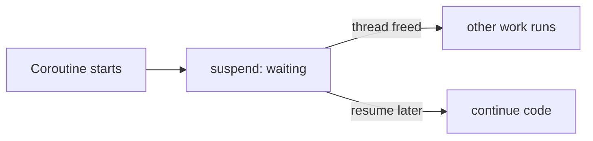

# guided-learning/references/transcripts/01-kotlin-coroutines.md

## Transcript: Kotlin Coroutines (beginner)

---

## Turn 1

### User
Teach me Kotlin coroutines from scratch (Android context).

### Assistant
### Lesson TODO
- [ ] Coroutines vs threads (why they exist)
- [ ] `suspend` + "suspension" intuition
- [ ] Scope + structured concurrency (lifecycle tie-in)
- [ ] Dispatchers (`Main/IO/Default`) and blocking vs suspending
- [ ] `launch` vs `async` + cancellation basics
- [ ] Common pitfalls (`GlobalScope`, leaks, blocking main)

### Chunk
A coroutine is a lightweight unit of work that can **pause** (suspend) and later **resume** without blocking a thread. Threads are expensive OS resources; coroutines are cheap, so you can run lots of them on a small number of threads.

Coroutines matter on Android because you want responsive UI: do slow work off the main thread, but still write code that *reads* like normal sequential code instead of callbacks everywhere.

### Visual (optional)
| Concept | Thread | Coroutine |
|---|---:|---:|
| Cost | high | low |
| Waiting for network | blocks thread | suspends (thread free) |
| Count you can run | small | huge |

### Question
If coroutines are "cheap", does that mean they don't use threads at all?

<!-- LESSON_STATE: topic=coroutines step=1 mastery=0.2 last_q=threads-needed -->

---

## Turn 2

### User
They still use threads, just managed by dispatchers/schedulers. Cheap means not 1:1 thread.

### Assistant
### Lesson TODO
- [x] Coroutines vs threads (why they exist)
- [ ] `suspend` + "suspension" intuition
- [ ] Scope + structured concurrency (lifecycle tie-in)
- [ ] Dispatchers (`Main/IO/Default`) and blocking vs suspending
- [ ] `launch` vs `async` + cancellation basics
- [ ] Common pitfalls (`GlobalScope`, leaks, blocking main)

### Chunk
Correct. Coroutines run **on top of** threads; "cheap" means you don't pay the OS cost per task. The dispatcher decides which threads are used; the coroutine can hop around.

Next: `suspend` doesn't mean "runs in background." It means "this function may pause here." While paused (e.g., waiting on network), the thread can run other work.

### Visual (optional)

### Question

Is a suspend fun automatically executed on Dispatchers.IO just because it might wait on network?

<!-- LESSON_STATE: topic=coroutines step=2 mastery=0.35 last_q=suspend-dispatcher -->
