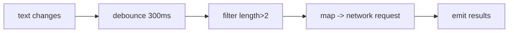

# guided-learning/references/transcripts/02-kotlin-flow.md

## Transcript: Kotlin Flow (bridge from coroutines)

---

## Turn 1

### User
I know basic coroutines. Teach me Kotlin Flow step by step.

### Assistant
### Lesson TODO
- [ ] What Flow represents (stream of values over time)
- [ ] Cold vs hot (why it matters)
- [ ] Common operators (`map`, `filter`, `debounce`)
- [ ] Collecting safely (lifecycle)
- [ ] Error handling + cancellation
- [ ] When to use Flow vs suspend vs LiveData

### Chunk
A Flow is a **stream**: it can emit multiple values over time (like "search query text changes" or "DB rows updates"). A `suspend fun` usually gives one result; Flow is for "many results over time."

By default, Flow is **cold**: nothing happens until you collect it. That's useful: you can build pipelines (operators) without doing work until someone needs it.

### Visual (optional)
| Thing | Emits | Typical |
|---|---|---|
| `suspend fun` | one value | fetch user profile |
| `Flow<T>` | many values | observe DB / UI events |

### Question
If a Flow is cold, what do you think happens if nobody collects it?

<!-- LESSON_STATE: topic=flow step=1 mastery=0.25 last_q=cold-no-collect -->

---

## Turn 2

### User
It won't execute / emit anything.

### Assistant
### Lesson TODO
- [x] What Flow represents (stream of values over time)
- [x] Cold vs hot (why it matters)
- [ ] Common operators (`map`, `filter`, `debounce`)
- [ ] Collecting safely (lifecycle)
- [ ] Error handling + cancellation
- [ ] When to use Flow vs suspend vs LiveData

### Chunk
Correct. Cold means the pipeline is "a recipe"; collection triggers actual execution.

Next: operators are transformations. You can `map` values, `filter` unwanted ones, and use time operators like `debounce` to avoid spamming network calls (classic search UI case).

### Visual (optional)

### Question

In a search box UI, why is debounce usually better than firing a request on every keystroke?

<!-- LESSON_STATE: topic=flow step=2 mastery=0.4 last_q=debounce-why -->
